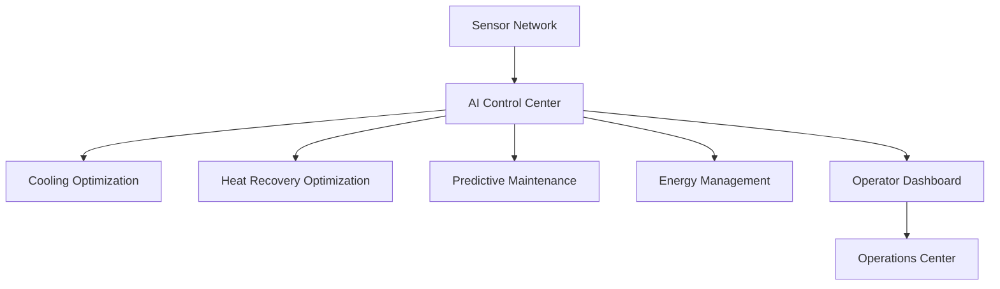

# AI Control Center Diagram

## Purpose

This diagram illustrates how the AI Control Center receives sensor data, analyzes system performance, optimizes cooling and heat recovery, supports predictive maintenance, and provides operational recommendations through the dashboard.
