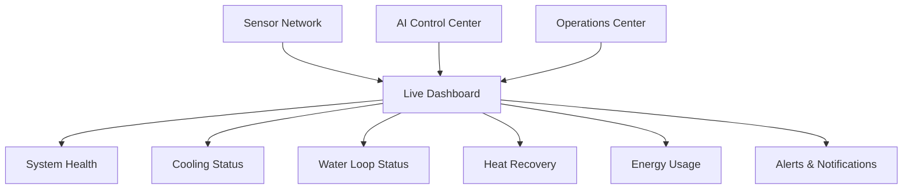

# Dashboard Diagram



## Purpose

This diagram illustrates the centralized dashboard that provides operators with a real-time view of system health, cooling performance, water circulation, heat recovery, energy usage, and active alerts.
```
