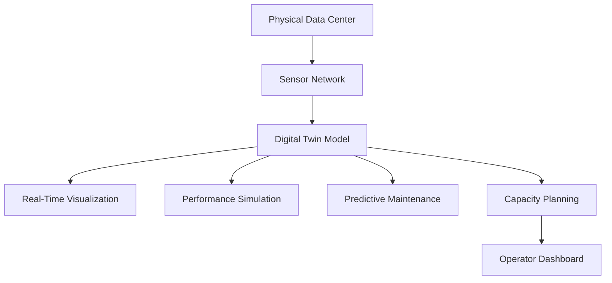

# Digital Twin Diagram



## Purpose

This diagram illustrates how a digital twin mirrors the physical data center by using real-time sensor data to visualize system performance, simulate operational scenarios, support predictive maintenance, and assist with future capacity planning.
```
