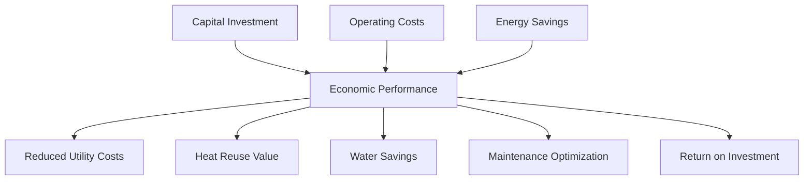

# Economics Diagram



## Purpose

This diagram illustrates the major economic factors associated with the system, including capital investment, operating costs, energy savings, water conservation, maintenance optimization, and long-term return on investment.
```
