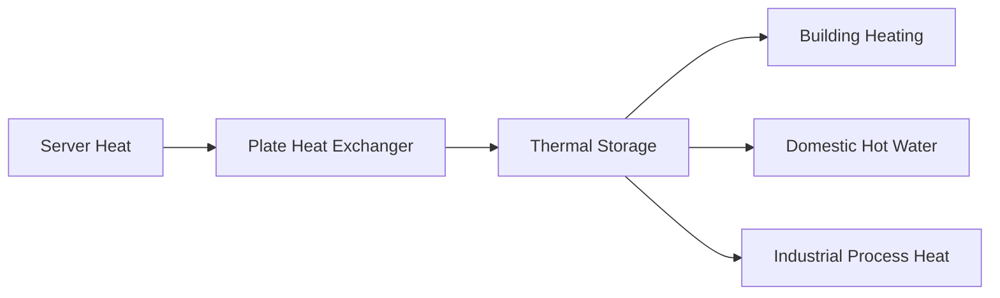

# Heat Recovery Diagram

```mermaid
flowchart LR
    A[Server Heat] --> B[Plate Heat Exchanger]
    B --> C[Thermal Storage]
    C --> D[Building Heating]
    C --> E[Domestic Hot Water]
    C --> F[Industrial Process Heat]
```

## Purpose

This diagram illustrates how waste heat from the data center is captured, transferred, stored, and reused for practical applications.
