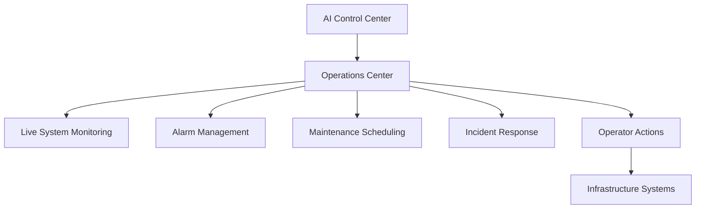

# Operations Center Diagram



## Purpose

This diagram illustrates how the Operations Center provides centralized monitoring, alarm management, maintenance coordination, and operator control across the data center infrastructure.
```
