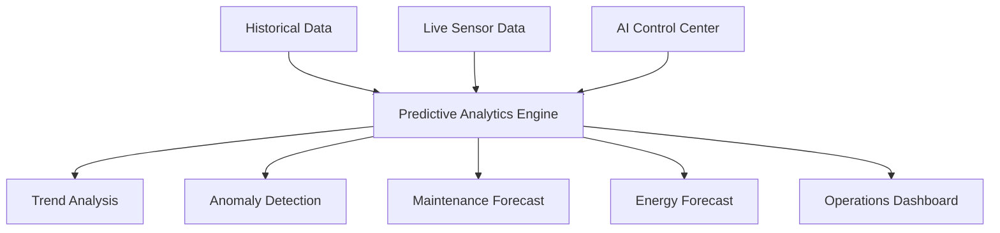

# Predictive Analytics Diagram



## Purpose

This diagram illustrates how historical operational data, live sensor measurements, and AI-assisted analysis are combined to identify trends, detect anomalies, forecast maintenance needs, and support operational decision-making.
```
