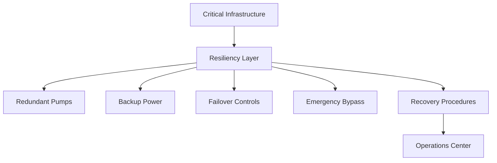

# Resiliency Diagram

## Purpose

This diagram illustrates the resiliency layer that supports continued operation during equipment failures, utility interruptions, control issues, or emergency events.
