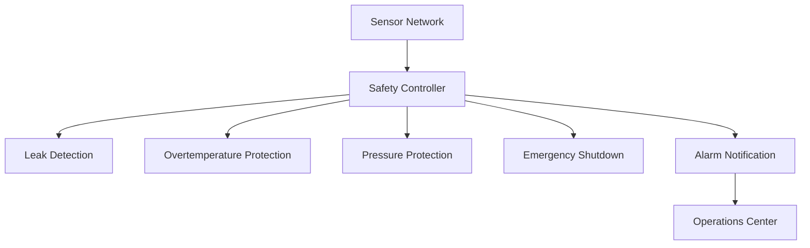

# Safety Diagram



## Purpose

This diagram illustrates the safety layer responsible for monitoring critical operating conditions, detecting abnormal events, initiating protective actions, and notifying operators to maintain safe system operation.
```
