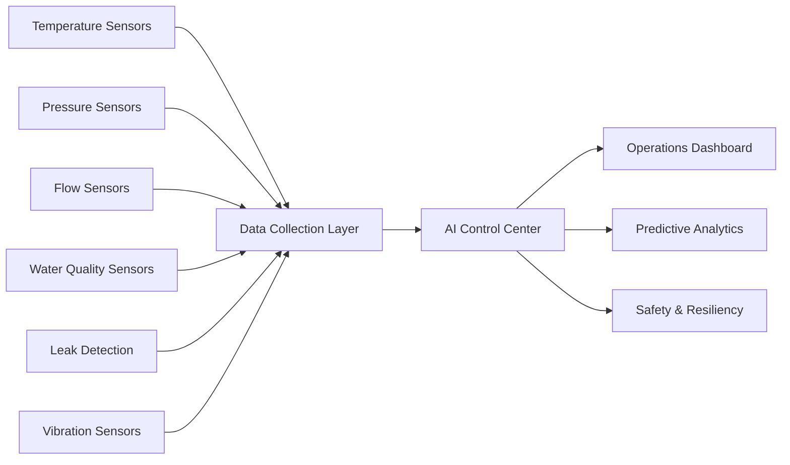

# Sensor Network Diagram

## Purpose

This diagram illustrates how distributed sensors continuously monitor the cooling system, water infrastructure, and equipment health while providing real-time operational awareness and predictive analytics.
