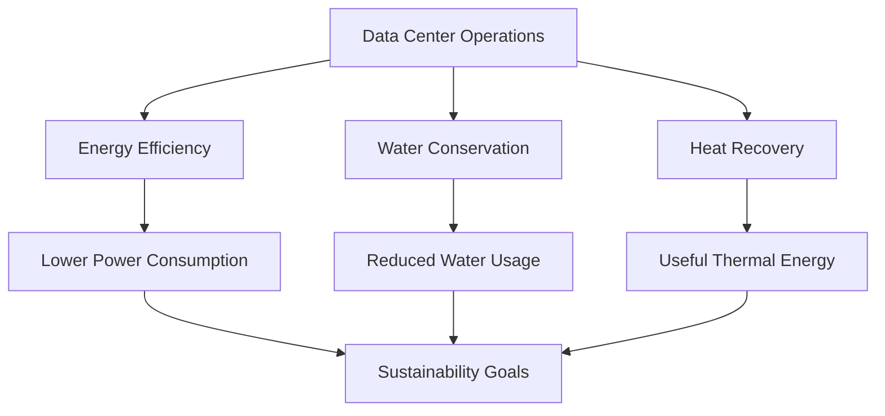

# Sustainability Diagram



## Purpose

This diagram illustrates how efficient cooling, water conservation, and waste heat recovery contribute to the overall sustainability objectives of the data center while supporting reliable long-term operation.
```
