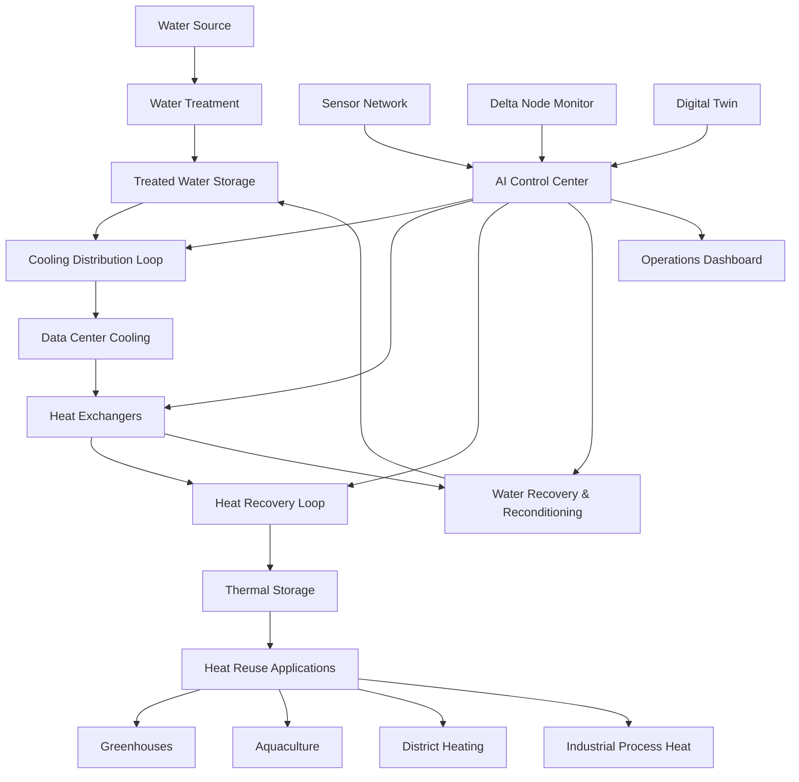

# Architecture Diagram

```mermaid
flowchart TD
    A[Water Source] --> B[Water Treatment]
    B --> C[Treated Water Storage]
    C --> D[Cooling Distribution Loop]
    D --> E[Data Center Cooling]
    E --> F[Heat Exchangers]
    F --> G[Heat Recovery Loop]
    G --> H[Thermal Storage]
    H --> I[Heat Reuse Applications]

    I --> I1[Greenhouses]
    I --> I2[Aquaculture]
    I --> I3[District Heating]
    I --> I4[Industrial Process Heat]

    F --> J[Water Recovery & Reconditioning]
    J --> C

    K[Sensor Network] --> L[AI Control Center]
    L --> D
    L --> F
    L --> G
    L --> J

    M[Delta Node Monitor] --> L
    N[Digital Twin] --> L
    L --> O[Operations Dashboard]
```
