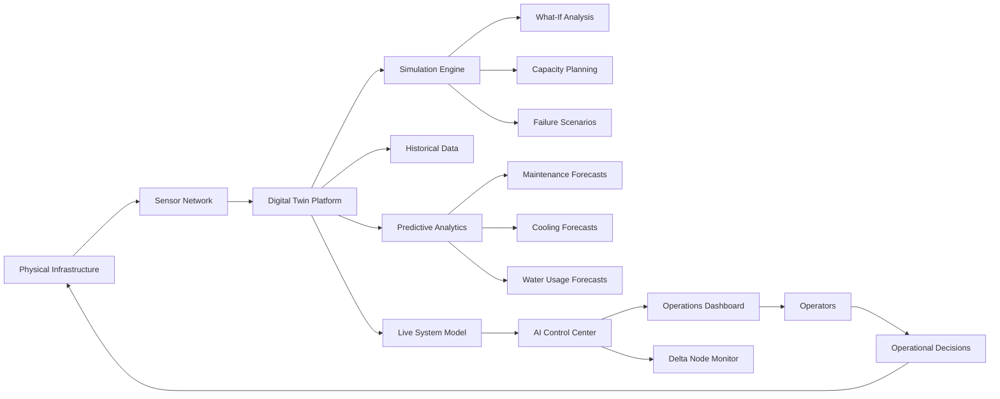

# Digital Twin Diagram

```mermaid
flowchart LR

A[Physical Infrastructure] --> B[Sensor Network]

B --> C[Digital Twin Platform]

C --> D[Live System Model]
C --> E[Historical Data]
C --> F[Predictive Analytics]
C --> G[Simulation Engine]

G --> H[What-If Analysis]
G --> I[Capacity Planning]
G --> J[Failure Scenarios]

F --> K[Maintenance Forecasts]
F --> L[Cooling Forecasts]
F --> M[Water Usage Forecasts]

D --> N[AI Control Center]

N --> O[Operations Dashboard]

N --> P[Delta Node Monitor]

O --> Q[Operators]

Q --> R[Operational Decisions]

R --> A
```
