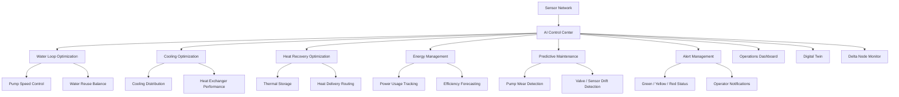

# AI Control Center Diagram

```mermaid
flowchart TD

A[Sensor Network] --> B[AI Control Center]

B --> C[Water Loop Optimization]
B --> D[Cooling Optimization]
B --> E[Heat Recovery Optimization]
B --> F[Energy Management]
B --> G[Predictive Maintenance]
B --> H[Alert Management]

C --> I[Pump Speed Control]
C --> J[Water Reuse Balance]

D --> K[Cooling Distribution]
D --> L[Heat Exchanger Performance]

E --> M[Thermal Storage]
E --> N[Heat Delivery Routing]

F --> O[Power Usage Tracking]
F --> P[Efficiency Forecasting]

G --> Q[Pump Wear Detection]
G --> R[Valve / Sensor Drift Detection]

H --> S[Green / Yellow / Red Status]
H --> T[Operator Notifications]

B --> U[Operations Dashboard]
B --> V[Digital Twin]
B --> W[Delta Node Monitor]
```
