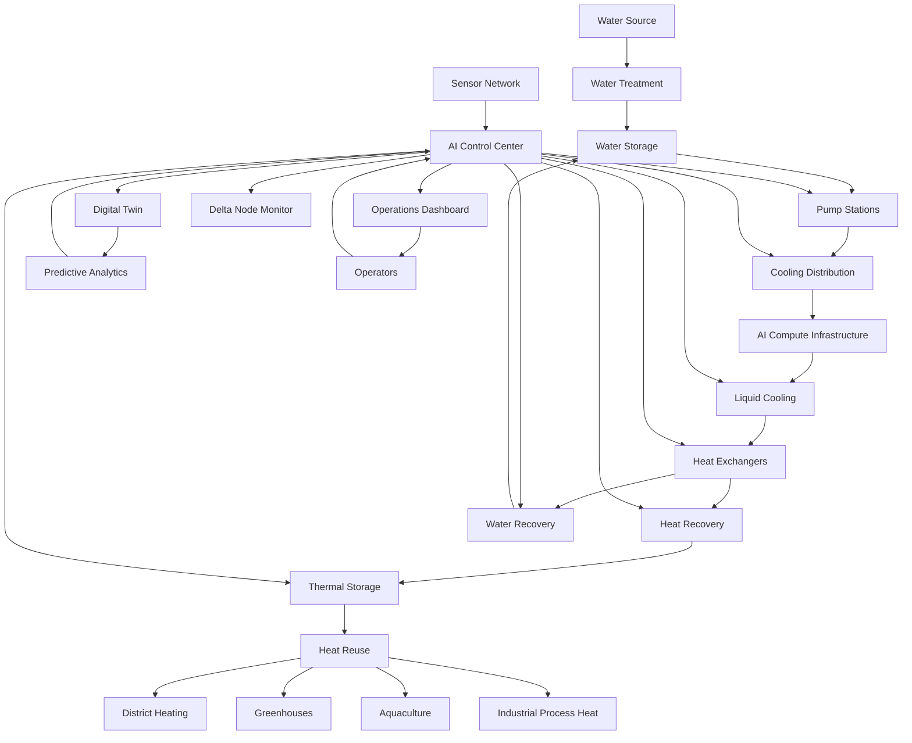

# Data Center Water & Heat Loop Ecosystem

```mermaid
flowchart TD

A[Water Source]

A --> B[Water Treatment]

B --> C[Water Storage]

C --> D[Pump Stations]

D --> E[Cooling Distribution]

E --> F[AI Compute Infrastructure]

F --> G[Liquid Cooling]

G --> H[Heat Exchangers]

H --> I[Heat Recovery]

I --> J[Thermal Storage]

J --> K[Heat Reuse]

K --> K1[District Heating]
K --> K2[Greenhouses]
K --> K3[Aquaculture]
K --> K4[Industrial Process Heat]

H --> L[Water Recovery]

L --> C

M[Sensor Network] --> N[AI Control Center]

N --> D
N --> E
N --> G
N --> H
N --> I
N --> J
N --> L

N --> O[Operations Dashboard]

N --> P[Digital Twin]

P --> Q[Predictive Analytics]

Q --> N

O --> R[Operators]

R --> N

N --> S[Delta Node Monitor]
```
