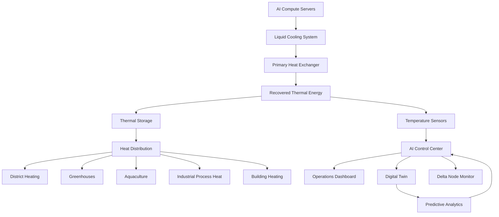

# Heat Recovery Diagram

```mermaid
flowchart TD

A[AI Compute Servers] --> B[Liquid Cooling System]

B --> C[Primary Heat Exchanger]

C --> D[Recovered Thermal Energy]

D --> E[Thermal Storage]

E --> F[Heat Distribution]

F --> G[District Heating]

F --> H[Greenhouses]

F --> I[Aquaculture]

F --> J[Industrial Process Heat]

F --> K[Building Heating]

D --> L[Temperature Sensors]

L --> M[AI Control Center]

M --> N[Operations Dashboard]

M --> O[Digital Twin]

O --> P[Predictive Analytics]

P --> M

M --> Q[Delta Node Monitor]
```
