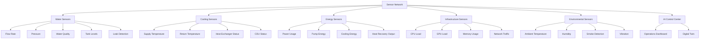

# Sensor Network Diagram

```mermaid
flowchart TD

A[Sensor Network] --> B[Water Sensors]
A --> C[Cooling Sensors]
A --> D[Energy Sensors]
A --> E[Infrastructure Sensors]
A --> F[Environmental Sensors]

B --> B1[Flow Rate]
B --> B2[Pressure]
B --> B3[Water Quality]
B --> B4[Tank Levels]
B --> B5[Leak Detection]

C --> C1[Supply Temperature]
C --> C2[Return Temperature]
C --> C3[Heat Exchanger Status]
C --> C4[CDU Status]

D --> D1[Power Usage]
D --> D2[Pump Energy]
D --> D3[Cooling Energy]
D --> D4[Heat Recovery Output]

E --> E1[CPU Load]
E --> E2[GPU Load]
E --> E3[Memory Usage]
E --> E4[Network Traffic]

F --> F1[Ambient Temperature]
F --> F2[Humidity]
F --> F3[Smoke Detection]
F --> F4[Vibration]

A --> G[AI Control Center]
G --> H[Operations Dashboard]
G --> I[Digital Twin]
```
