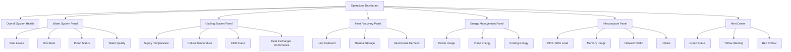

# Operations Dashboard Diagram

```mermaid
flowchart TD

A[Operations Dashboard] --> B[Overall System Health]

A --> C[Water System Panel]
A --> D[Cooling System Panel]
A --> E[Heat Recovery Panel]
A --> F[Energy Management Panel]
A --> G[Infrastructure Panel]
A --> H[Alert Center]

C --> C1[Tank Levels]
C --> C2[Flow Rate]
C --> C3[Pump Status]
C --> C4[Water Quality]

D --> D1[Supply Temperature]
D --> D2[Return Temperature]
D --> D3[CDU Status]
D --> D4[Heat Exchanger Performance]

E --> E1[Heat Captured]
E --> E2[Thermal Storage]
E --> E3[Heat Reuse Demand]

F --> F1[Power Usage]
F --> F2[Pump Energy]
F --> F3[Cooling Energy]

G --> G1[CPU / GPU Load]
G --> G2[Memory Usage]
G --> G3[Network Traffic]
G --> G4[Uptime]

H --> H1[Green Status]
H --> H2[Yellow Warning]
H --> H3[Red Critical]
```
