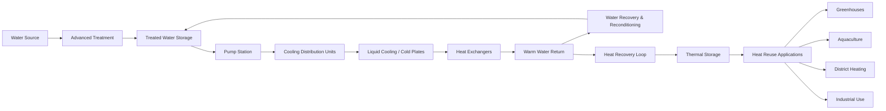

# Water Loop Diagram

```mermaid
flowchart LR
    A[Water Source] --> B[Advanced Treatment]
    B --> C[Treated Water Storage]
    C --> D[Pump Station]
    D --> E[Cooling Distribution Units]
    E --> F[Liquid Cooling / Cold Plates]
    F --> G[Heat Exchangers]
    G --> H[Warm Water Return]
    H --> I[Water Recovery & Reconditioning]
    I --> C

    H --> J[Heat Recovery Loop]
    J --> K[Thermal Storage]
    K --> L[Heat Reuse Applications]

    L --> L1[Greenhouses]
    L --> L2[Aquaculture]
    L --> L3[District Heating]
    L --> L4[Industrial Use]
```
